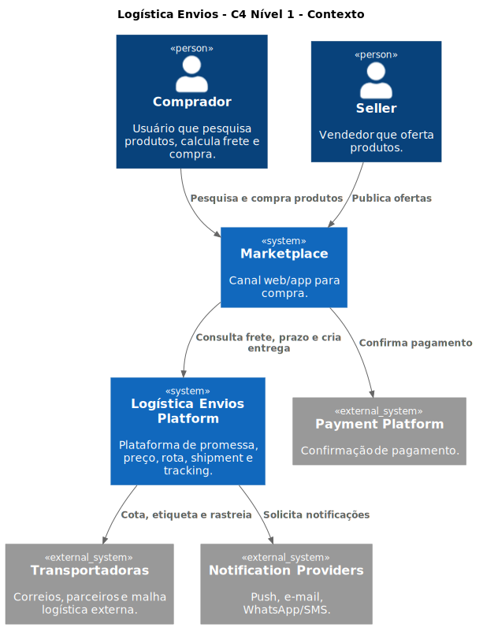
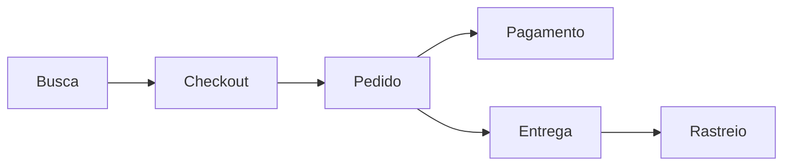

# Logística Marketplace

Arquitetura de referência de uma plataforma de logística para marketplace, construída para demonstrar decisões reais de sistemas distribuídos: microsserviços, Kafka, saga, idempotência, observabilidade e ownership de dados.

[:material-map-outline: Explorar a arquitetura](contracts/services-map.md){ .md-button .md-button--primary }
[:material-github: Ver o repositório](https://github.com/leandrosflora/logistica-marketplace-demo-arch){ .md-button }

## Visão geral

## Pilares

-   :material-transit-connection-variant:{ .lg .middle } **Event Driven Architecture**

    ---

    Kafka conecta os domínios e reduz acoplamento, com contratos e evolução de schemas governados.

    [Eventos Kafka](contracts/kafka-events.md)

-   :material-state-machine:{ .lg .middle } **Saga e confiabilidade**

    ---

    O pedido coordena reservas, pagamento e entrega com compensações, Inbox/Outbox e idempotência.

    [Saga de pedido](services/order-service.md)

-   :material-database-lock:{ .lg .middle } **Ownership de dados**

    ---

    Cada serviço domina seu banco, schema e cache. Integrações ocorrem por APIs e eventos explícitos.

    [Mapa de dados](contracts/data-stores.md)

-   :material-chart-timeline-variant-shimmer:{ .lg .middle } **Observabilidade ponta a ponta**

    ---

    Logs, métricas e traces correlacionam a jornada entre APIs REST, consumidores e produtores Kafka.

    [Observabilidade](devops/observability.md)

## Jornada principal

A documentação cobre o caminho feliz, cenários alternativos, falhas e compensações. Consulte as [jornadas detalhadas](sequence-diagrams/README.md).

## Stack

| Capacidade | Tecnologia e padrão |
|---|---|
| APIs e serviços | .NET 8, C#, REST, arquitetura hexagonal |
| Eventos | Apache Kafka, contratos versionados |
| Persistência | PostgreSQL e Redis |
| Confiabilidade | Saga, Inbox/Outbox e idempotência |
| Observabilidade | OpenTelemetry, Prometheus, Grafana, Loki e Jaeger |
| Execução local | Docker Compose |

!!! info "Repositório arquitetural"
    Este projeto concentra contratos, decisões, diagramas e guias operacionais. O código dos serviços está distribuído nos repositórios relacionados no [mapa de serviços](contracts/services-map.md).
